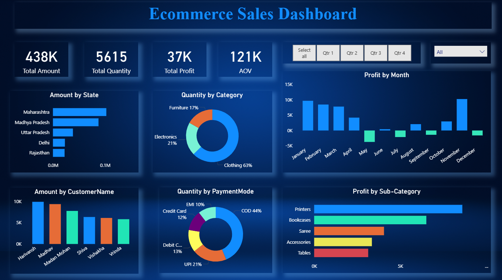

# 🛒 Ecommerce Sales Dashboard (Power BI Project)

This repository features an interactive **Ecommerce Sales Dashboard** built using **Power BI**. It presents visual insights into ecommerce performance, allowing users to track key metrics such as total sales, profit, quantity sold, and more — segmented across months, states, payment modes, and product categories.

---

## 📁 Project Structure

```
📦 Ecommerce-Sales-Dashboard/
├── 📊 Ecommerce Sales Dashboard.pbix    # Power BI report file
├── 📄 Orders.csv                        # Ecommerce order dataset
├── 📄 Details.csv                       # Product and transaction-level details
├── 🖼️ Screenshot (366).png               # Dashboard image preview
└── 📄 README.md                          # Project documentation
```

---

## 💡 Key Features

- **Total KPIs**
  - Total Amount: **438K**
  - Total Quantity Sold: **5615**
  - Total Profit: **37K**
  - Average Order Value (AOV): **121K**

- **State-wise Sales**
  - Bar chart of sales by top Indian states: Maharashtra, MP, UP, etc.

- **Category and Sub-Category Performance**
  - Donut charts showing quantity breakdown by main **Category** and **Payment Mode**
  - Horizontal bar chart showing **Profit by Sub-Category** (Printers, Sarees, etc.)

- **Customer Analysis**
  - Sales amount by **Customer Name**

- **Time Series Trends**
  - **Profit by Month** visualized over 12 months
  - Slicer to filter by **Quarter**

---

## 📦 Data Sources

- **Orders.csv**: Includes order IDs, sales, and profit information.
- **Details.csv**: Contains product categories, customer data, and payment information.

---

## 🧰 Tools & Technologies

- **Power BI Desktop**
- **CSV Files** as data sources
- **DAX** for calculated measures
- Interactive slicers and visuals

---

## 🚀 Getting Started

1. Clone this repository or download it:
   ```bash
   git clone https://github.com/your-username/ecommerce-sales-dashboard.git
   ```

2. Open `Ecommerce Sales Dashboard.pbix` in **Power BI Desktop**.

3. Ensure both `Orders.csv` and `Details.csv` are in the same directory.

4. If necessary, relink the datasets using **Transform Data** → **Edit Queries** in Power BI.

5. Explore dashboard insights through filters and visuals.

---

## 📷 Dashboard Preview

See below for the dashboard layout:  


---

## 🙋‍♀️ Author

Developed by **Marmik Gandhi** Feel free to connect:  
- GitHub: [@MarmikGandhi](https://github.com/MarmikGandhi)
- Email: [marmikgandhi@gamil.com](mailto:marmikgandhi@gamil.com)
- LinkedIn: [marmik-gandhi](https://www.linkedin.com/in/marmik-gandhi-006a55323/)

---

## 📝 License

This project is open-source and available under the [MIT License](LICENSE).
